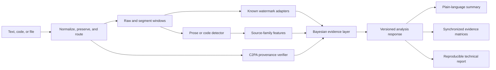

# Panoptes Evidence Workbench

Panoptes is an open-source scientific workbench for analyzing text and code for **calibrated evidence of AI participation**, **public watermark signals**, **source-family similarity**, and **signed file provenance**.

It is designed to answer a narrow question carefully:

> “Given the submitted content, the enabled detectors, and the selected prior odds, what statistical evidence is available — and how reliable is that evidence under the current calibration cohort?”

Panoptes deliberately avoids authorship verdicts. It reports probabilities, hypothesis tests, confidence intervals, abstention states, and limitations so that technical and non-technical users can see both the answer and the uncertainty around it.

## Table of contents

1. [What Panoptes measures](#what-panoptes-measures)
2. [Architecture](#architecture)
3. [Quick start](#quick-start)
4. [Using the observatory UI](#using-the-observatory-ui)
5. [Understanding the science](#understanding-the-science)
6. [Capability matrix](#capability-matrix)
7. [Contributing marker and calibration data](#contributing-marker-and-calibration-data)
8. [Model baselines](#model-baselines)
9. [Testing and reproduction](#testing-and-reproduction)
10. [Deployment](#deployment)
11. [Limitations and responsible use](#limitations-and-responsible-use)
12. [References](#references)

## What Panoptes measures

### 1. Passive AI-participation evidence

A detector produces a raw score for prose or code. Panoptes then maps that score through a held-out calibration artifact so the user sees calibrated probabilities for:

- human-written;
- AI-generated;
- AI-refined or mixed participation.

The posterior is represented as:

\[
O_1 = O_0 \times \mathrm{LR}
\]

where \(O_0\) is the user-selected prior odds and \(\mathrm{LR}\) is the detector likelihood ratio. The UI exposes the prior, likelihood ratio, posterior odds, calibration bundle, cohort, and reliability error.

### 2. Known public watermark tests

For schemes with public detectors, Panoptes tests the submitted text against the scheme’s null distribution. The KGW reference detector uses a green-list hypothesis test:

\[
z = \frac{G - \gamma n}{\sqrt{n\gamma(1-\gamma)}}, \qquad p = 1 - \Phi(z)
\]

where \(G\) is the number of green-list tokens, \(n\) is the number of eligible tokens, \(\gamma\) is the expected green fraction under the null, and \(\Phi\) is the standard normal CDF. Multiple tested schemes receive Benjamini-Hochberg \(q\)-values.

### 3. Source-family similarity

Feature vectors are compared to calibrated family centroids using Mahalanobis distance:

\[
d_m^2 = (x-\mu_m)^T\Sigma^{-1}(x-\mu_m)
\]

Distances are mapped into conditional similarity probabilities. An explicit unknown/open-set score is always shown because an unknown generator should remain unknown rather than being assigned to the nearest family.

### 4. Signed file provenance

For uploaded files, Panoptes verifies C2PA provenance and certificate chains where available. Provenance can tell you that a file was signed and processed by a particular issuer; it cannot tell you who authored the semantic content.

## Architecture



## Quick start

### Requirements

- Python 3.11+
- Node.js 20+
- Optional: NVIDIA GPU + drivers for `local-gpu` model profiles

### Local run

```bash
git clone https://github.com/Encryptic1/Panoptes.git
cd Panoptes
python -m venv .venv
.venv\Scripts\activate       # Windows
# source .venv/bin/activate  # macOS/Linux
pip install -e backend[dev]
cd frontend
npm install
npm run build
cd ..
panoptes up --profile local-gpu
```

Open `http://localhost:8000`.

For offline development, use:

```bash
panoptes up --profile fixture --port 8001
```

## Using the observatory UI

The interface is organized as progressive disclosure:

1. **Answer strip** — plain-language conclusion, evidence state, confidence label, and calibrated outcome distribution.
2. **Source overlay** — submitted text with green/non-green watermark token spans when available.
3. **Segment strip** — synchronized segment selection for matrices, source-family rows, and token overlays.
4. **Evidence matrices** — source-family similarity and watermark evidence strength by segment.
5. **Technical laboratory** — KaTeX-rendered equations, posterior decomposition, Wilson intervals, FDR-adjusted \(q\)-values, statistical power, dilution estimates, assumptions, and limitations.

## Understanding the science

### Calibration matters

A detector score is not a probability. Panoptes uses held-out calibration artifacts (currently synthetic for the development baseline) to map scores into calibrated outcomes. The calibration bundle ID, cohort, and reliability error are part of every report.

### Watermark tests are hypothesis tests

A watermark result is evidence about whether a known public scheme’s null hypothesis can be rejected. A p-value is not the probability that text is watermarked. A negative result is not evidence that text is human-written.

### Open-set attribution

Model families are conditional similarity among supported candidates. Panoptes keeps an explicit unknown state and uses conformal-style thresholds to avoid forcing attribution when an input does not resemble any calibrated family.

### Code is different

Code has lower entropy, stricter syntax, and frequent formatting transformations. Panoptes therefore treats code as a separate cohort and plans code-specific watermark adapters such as SWEET-style selective watermarking.

## Capability matrix

| Capability | Status | Cohort | Notes |
| --- | --- | --- | --- |
| Generic prose AI detection | Baseline | English prose | Synthetic calibration artifact currently validates pipeline only |
| Code AI detection | Baseline | Python, C-family, Go, Java, JS | Formatting-sensitive |
| KGW watermark test | Reference detector | Public scheme | Green-list \(z\)-score, FDR \(q\)-values, token overlay |
| Claude text watermark | Adapter pending | Unknown | No public detector details available |
| Source-family similarity | Baseline | Calibrated candidates only | Includes unknown/open-set score |
| C2PA provenance | File uploads | PNG/JPEG/SVG baseline | Verifies signed manifests where available |

## Contributing marker and calibration data

Panoptes uses **signed pointer manifests and hashed artifacts**. Raw third-party corpora are not committed.

- Dataset pointers live in `datasets/manifests/`.
- Contributor artifacts live in `research/submissions/<contribution-id>/`.
- Validate artifacts with:

```bash
python research/validate_submission.py path/to/artifact.json
```

A complete marker contribution includes:

1. `dataset-manifest.json`
2. `calibration-artifact.json` or `watermark-eval-card.json`
3. `benchmark-card.json`
4. `repro.md`
5. NOTICE entry
6. Tests for any detector or adapter changes

See [`docs/contributing-markers.md`](docs/contributing-markers.md).

## Model baselines

Panoptes maintains a canonical prompt set (8 text + 8 code prompts) that anyone can run against any model to produce comparable, hash-verifiable baseline outputs — the raw material for calibration cohorts and source-family geometry.

```bash
# manual: paste prompts from baselines/prompts/text.md into any model UI
python baselines/baseline.py scaffold --model gpt-5.6-sol --kind text
python baselines/baseline.py finalize --run baselines/runs/gpt-5.6-sol_text --interface chat-ui

# scripted: run the set against a provider API
python baselines/baseline.py run --model gpt-5.6-sol --provider openai --kind code
```

Every finalized run produces a schema-validated manifest (SHA-256 per output + a Merkle root) and can be shared to the community catalog **as hashes only** — raw outputs stay local and gitignored:

```bash
python baselines/baseline.py submit --run baselines/runs/gpt-5.6-sol_text --contributor your-handle
python baselines/baseline.py verify-catalog
```

Optional OpenTimestamps anchoring adds a Bitcoin-backed timestamp to a manifest. The catalog is a ledger of contributor *claims*, not verified model provenance — confidence comes from independent replication. See [`baselines/README.md`](baselines/README.md).

## Testing and reproduction

Backend:

```bash
cd backend
python -m pytest
```

Frontend:

```bash
cd frontend
npm test
npm run build
```

Research artifacts:

```bash
python research/calibration.py
python research/evaluate.py
python research/validate_submission.py backend/artifacts/baseline-calibration.json docs/benchmark-card.json
```

## Deployment

### Docker

```bash
docker build -t panoptes .
docker run -p 8000:8000 panoptes
```

### Render

Panoptes includes `render.yaml` for a single-container Render deployment. Configure:

- `PANOPTES_PROFILE=cloud-cpu` for standard deployment;
- `PANOPTES_PROFILE=cloud-gpu` only if the selected infrastructure supports GPU workers;
- `PANOPTES_ALLOW_SUBMITTED_TEXT_STORAGE=false` unless report persistence is explicitly enabled.

## Limitations and responsible use

- Panoptes does not determine authorship.
- A calibrated probability is conditional on the cohort, detector, and prior odds shown in the report.
- Short inputs, paraphrase, translation, mixed authorship, and domain shift reduce reliability.
- A negative watermark test is not evidence of human authorship.
- Source-family values are similarity, not exact model identity.
- Do not use Panoptes as the sole basis for discipline, legal action, employment decisions, or academic misconduct findings.

## References

1. Kirchenbauer, J., Geiping, J., Wen, Y., Katz, J., Miers, I., & Goldstein, T. (2023). **A watermark for large language models.** ICML.
2. Pan, L., Liu, W., Tan, W., et al. (2024). **MarkLLM: An open-source toolkit for LLM watermarking.** arXiv:2405.10051.
3. Dugan, L., Ippolito, D., Kirubarajan, A., et al. (2024). **RAID: A shared benchmark for robust evaluation of machine-generated text detectors.** ACL.
4. Orenstrakh, M. S., Karnalim, O., et al. (2023). **DroidCollection and DroidDetect: Machine-generated code detection resources.** Empirical Software Engineering.
5. C2PA (2024). **Content Credentials and provenance specification.** https://c2pa.org
6. Benjamini, Y., & Hochberg, Y. (1995). **Controlling the false discovery rate.** JRSS-B.
7. Mahalanobis, P. C. (1936). **On the generalized distance in statistics.** Proceedings of the National Institute of Sciences of India.
8. Vovk, V., Gammerman, A., & Shafer, G. (2005). **Algorithmic Learning in a Random World.** Springer.
9. Guo, C., Pleiss, G., Sun, Y., & Weinberger, K. Q. (2017). **On calibration of modern neural networks.** ICML.
10. Lee, J., Le, Q., et al. (2023). **SWEET: Selective watermarking via entropy thresholding for code generation.** arXiv.
