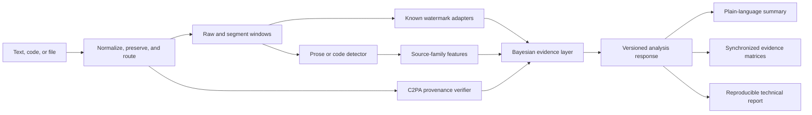

# Panoptes Evidence Workbench

Panoptes is an open-source scientific workbench for analyzing text and code for **calibrated evidence of AI participation**, **public watermark signals**, **source-family similarity**, and **signed file provenance**.

It is designed to answer a narrow question carefully:

> “Given the submitted content, the enabled detectors, and the selected prior odds, what statistical evidence is available — and how reliable is that evidence under the current calibration cohort?”

Panoptes deliberately avoids authorship verdicts. It reports probabilities, hypothesis tests, confidence intervals, abstention states, and limitations so that technical and non-technical users can see both the answer and the uncertainty around it.

## Table of contents

1. [What Panoptes measures](#what-panoptes-measures)
2. [Architecture](#architecture)
3. [Quick start](#quick-start)
4. [Using the observatory UI](#using-the-observatory-ui)
5. [Understanding the science](#understanding-the-science)
6. [Capability matrix](#capability-matrix)
7. [Contributing marker and calibration data](#contributing-marker-and-calibration-data)
8. [Model baselines](#model-baselines)
9. [Testing and reproduction](#testing-and-reproduction)
10. [Deployment](#deployment)
11. [Limitations and responsible use](#limitations-and-responsible-use)
12. [References](#references)

## What Panoptes measures

### 1. Passive AI-participation evidence

A detector produces a raw score for prose or code. Panoptes then maps that score through a held-out calibration artifact so the user sees calibrated probabilities for:

- human-written;
- AI-generated;
- AI-refined or mixed participation.

The posterior is represented as:

\[
O_1 = O_0 \times \mathrm{LR}
\]

where \(O_0\) is the user-selected prior odds and \(\mathrm{LR}\) is the detector likelihood ratio. The UI exposes the prior, likelihood ratio, posterior odds, calibration bundle, cohort, and reliability error.

### 2. Known public watermark tests

For schemes with public detectors, Panoptes tests the submitted text against the scheme’s null distribution. The KGW reference detector uses a green-list hypothesis test:

\[
z = \frac{G - \gamma n}{\sqrt{n\gamma(1-\gamma)}}, \qquad p = 1 - \Phi(z)
\]

where \(G\) is the number of green-list tokens, \(n\) is the number of eligible tokens, \(\gamma\) is the expected green fraction under the null, and \(\Phi\) is the standard normal CDF. Multiple tested schemes receive Benjamini-Hochberg \(q\)-values.

### 3. Source-family similarity

Feature vectors are compared to calibrated family centroids using Mahalanobis distance:

\[
d_m^2 = (x-\mu_m)^T\Sigma^{-1}(x-\mu_m)
\]

Distances are mapped into conditional similarity probabilities. An explicit unknown/open-set score is always shown because an unknown generator should remain unknown rather than being assigned to the nearest family.

### 4. Signed file provenance

For uploaded files, Panoptes verifies C2PA provenance and certificate chains where available. Provenance can tell you that a file was signed and processed by a particular issuer; it cannot tell you who authored the semantic content.

## Architecture



## Quick start

### Requirements

- Python 3.11+
- Node.js 20+
- Optional: NVIDIA GPU + drivers for `local-gpu` model profiles

### Local run

```bash
git clone https://github.com/Encryptic1/Panoptes.git
cd Panoptes
python -m venv .venv
.venv\Scripts\activate       # Windows
# source .venv/bin/activate  # macOS/Linux
pip install -e backend[dev]
cd frontend
npm install
npm run build
cd ..
panoptes up --profile local-gpu
```

Open `http://localhost:8000`.

For offline development, use:

```bash
panoptes up --profile fixture --port 8001
```

## Using the observatory UI

The interface is organized as progressive disclosure:

1. **Answer strip** — plain-language conclusion, evidence state, confidence label, and calibrated outcome distribution.
2. **Source overlay** — submitted text with green/non-green watermark token spans when available.
3. **Segment strip** — synchronized segment selection for matrices, source-family rows, and token overlays.
4. **Evidence matrices** — source-family similarity and watermark evidence strength by segment.
5. **Technical laboratory** — KaTeX-rendered equations, posterior decomposition, Wilson intervals, FDR-adjusted \(q\)-values, statistical power, dilution estimates, assumptions, and limitations.
6. **Corpus figures** — posterior sensitivity to the prior, reliability diagram, statistical power curve, coverage-vs-abstention curve, input stylometric profile vs corpus ranges, verified-corpus summary, and the Panoptes-v0 model card — all rendered from the signed artifacts and degrading gracefully when an artifact is absent.

## Understanding the science

### Calibration matters

A detector score is not a probability. Panoptes maps raw detector scores into calibrated outcomes through an isotonic-regression artifact fitted on the verified reference corpus (`backend/artifacts/baseline-calibration.json`, regenerated by `python research/calibration.py`). The calibration bundle ID, cohort, reliability error, and corpus provenance are part of every report, and the full `calibration` block (ECE, Brier, AUROC, reliability bins) is exposed in the API response and rendered as a reliability diagram in the UI.

### Watermark tests are hypothesis tests

A watermark result is evidence about whether a known public scheme’s null hypothesis can be rejected. A p-value is not the probability that text is watermarked. A negative result is not evidence that text is human-written.

### Open-set attribution

Model families are conditional similarity among supported candidates. Panoptes keeps an explicit unknown state and uses conformal-style thresholds to avoid forcing attribution when an input does not resemble any calibrated family.

### Code is different

Code has lower entropy, stricter syntax, and frequent formatting transformations. Panoptes therefore treats code as a separate cohort and plans code-specific watermark adapters such as SWEET-style selective watermarking.

## Capability matrix

| Capability | Status | Cohort | Notes |
| --- | --- | --- | --- |
| Generic prose AI detection | Baseline | English prose | Isotonic calibration fitted on the verified reference corpus (n=104) |
| Code AI detection | Baseline | Python, C-family, Go, Java, JS | Formatting-sensitive; corpus-fitted calibration |
| KGW watermark test | Reference detector | Public scheme | Green-list \(z\)-score, FDR \(q\)-values, token overlay |
| Claude text watermark | Adapter pending | Unknown | No public detector details available |
| Source-family similarity | Baseline | Calibrated candidates only | Includes unknown/open-set score |
| C2PA provenance | File uploads | PNG/JPEG/SVG baseline | Verifies signed manifests where available |

## Contributing marker and calibration data

Panoptes uses **signed pointer manifests and hashed artifacts**. Raw third-party corpora are not committed.

- Dataset pointers live in `datasets/manifests/`.
- Contributor artifacts live in `research/submissions/<contribution-id>/`.
- Validate artifacts with:

```bash
python research/validate_submission.py path/to/artifact.json
```

A complete marker contribution includes:

1. `dataset-manifest.json`
2. `calibration-artifact.json` or `watermark-eval-card.json`
3. `benchmark-card.json`
4. `repro.md`
5. NOTICE entry
6. Tests for any detector or adapter changes

See [`docs/contributing-markers.md`](docs/contributing-markers.md).

## Model baselines

Panoptes maintains a canonical prompt set (8 text + 8 code prompts) that anyone can run against any model to produce comparable, hash-verifiable baseline outputs — the raw material for calibration cohorts and source-family geometry.

### Do the baselines feed the analyzer?

**Yes — through signed, hash-verified artifacts.** Raw baseline text never enters the runtime; instead the corpus is distilled offline into artifacts under `backend/artifacts/`, each schema-validated and SHA-256 self-signed, and the backend loads them at request time:

- **`baseline-calibration.json`** — isotonic score→probability map, corpus-fitted source-family Mahalanobis geometry, conformal thresholds, and reliability bins. Produced by `python research/calibration.py` (corpus mode is the default; `--synthetic` reproduces the old development fixture). Consumed by `backend/panoptes/analysis/calibration_bundle.py`; when the artifact is absent or fails verification the pipeline falls back to heuristic behavior and says so (`basis: heuristic`).
- **`corpus-summary.json`** — cohort composition and feature means, produced by `python research/baseline_corpus.py` after re-hashing every output file against its manifest (a tampered file rejects the whole run).
- **`methodology-report.json`** — VIF feature screening, the pre-registered hypothesis registry (H1–H6) with q-values and accept/reject decisions, and the econometric specification battery (link, Hosmer–Lemeshow, RESET, Breusch–Pagan, Jarque–Bera, Durbin–Watson). Produced by `python research/methodology.py`.
- **Model cards** (`cards/logistic-tier0.json`, `panoptes-v0-card.json`) — bench evaluation results with grouped cross-validation, power-gate rationale, and the Panoptes-v0 comparison battery (McNemar, DeLong).

All five are served read-only at `GET /api/v1/artifacts/<name>` and rendered in the UI (corpus panel, reliability diagram, power curve, coverage curve, model-card panel). Artifact timestamps are derived deterministically from the corpus manifests, so regeneration from the same corpus is byte-identical.

The live calculation combines:

- **Detector models** (e.g. `desklib-ai-text-detector`) for per-segment AI-participation scores;
- **corpus-fitted source-family geometry** (`backend/panoptes/analysis/attribution.py`) — Mahalanobis distance to per-family centroids fitted on the verified corpus, falling back to the hand-tuned stylometric softmax when the artifact is unavailable;
- a **request-supplied prior** (`prior_odds`, default 1.0) for the posterior decomposition.

The baseline corpus is therefore both verification *infrastructure* and a runtime *input* — and because only hashes and fitted parameters ship, raw third-party text is never committed or served.

### Running the prompt set

```bash
# manual: paste prompts from baselines/prompts/text.md into any model UI
python baselines/baseline.py scaffold --model gpt-5.6-sol --kind text
python baselines/baseline.py finalize --run baselines/runs/gpt-5.6-sol_text --interface chat-ui

# scripted: run the set against a provider API
python baselines/baseline.py run --model gpt-5.6-sol --provider openai --kind code
```

### Hashing and timestamping protocol

1. **Per-output SHA-256** — each saved output file is hashed; the manifest records only `prompt_id`, `file`, `sha256`, `bytes`. Raw model text is never embedded (the validator rejects it).
2. **Merkle root** — the sorted output hashes form a Merkle tree; its root commits to the entire output set in one value.
3. **Canonical manifest hash** — the manifest itself is serialized as canonical JSON (sorted keys, UTF-8, no insignificant whitespace) and self-hashed as `artifact_sha256`.
4. **Optional OpenTimestamps stamp** — `python baselines/baseline.py anchor --run <dir>` creates a Bitcoin-backed timestamp proof (`run.manifest.json.ots`); `ots upgrade <file>` completes it once the transaction confirms.
5. **Catalog registration** — `submit` appends one JSON line to `baselines/catalog/registry.jsonl` and stores the manifest under `baselines/catalog/manifests/<artifact_sha256>.json`.
6. **Verification** — `python baselines/baseline.py verify-catalog` re-checks every registry line against its manifest; CI enforces it on every PR.

### Contributing baselines, fixtures, or external data

- **Baseline runs** — finalize your run, then `python baselines/baseline.py submit --run <dir> --contributor your-handle` and open a PR containing *only* the registry line and manifest file. Raw outputs stay local (`baselines/runs/` is gitignored). See [`baselines/README.md`](baselines/README.md) and [`baselines/catalog/README.md`](baselines/catalog/README.md).
- **Fixtures** — the deterministic demo fixtures (`human-prose`, `ai-prose`, `code`) live in `backend/panoptes/analysis/pipeline.py`. Propose new ones via PR with a short rationale; fixture text must be original or license-clear.
- **External source data** — keep your corpus in your own repository or storage; do not commit third-party data here. Instead add a signed pointer manifest to `datasets/manifests/` describing `source.url`, `access` (`public` / `gated` / `manual-download`), `download_instructions`, and a SHA-256 `integrity` block (optionally `file_inventory_uri` for file-level hashes). Validate with `python research/validate_submission.py your-manifest.json`. See [`docs/contributing-markers.md`](docs/contributing-markers.md).

The catalog is a ledger of contributor *claims*, not verified model provenance — confidence comes from independent replication.

## Training bench and Panoptes-v0

The `bench/` package turns the verified corpus (and community datasets) into a reproducible training and evaluation harness:

```bash
python -m bench train --model logistic --data corpus      # tier-0 penalized logistic
python -m bench train --model panoptes-v0 --data corpus   # evidential neural (requires torch)
python -m bench evaluate --model backend/artifacts/cards/logistic-tier0.json
python -m bench validate --dataset your.csv               # your data vs shipped model
python -m bench contribute --dataset your.csv --name my-set
python -m bench predict --model panoptes-v0 --text "..."
```

- **Tiered model zoo with a power gate** — tier 0 (penalized logistic) always runs; tier 1 (gradient boosting) needs n≥300; the neural tier trains only when a statistical power analysis says the corpus can detect the minimum effect. The gate rationale is written into every model card.
- **Grouped evaluation** — GroupKFold by prompt (no prompt leakage between folds), ECE/Brier/AUROC/TPR@FPR, reliability bins, coverage-vs-abstention curves, conformal sets, and fairness slices by length bucket, kind, and family.
- **Panoptes-v0** — a custom evidential deep-learning architecture (Dirichlet evidence head à la Sensoy 2018) that natively outputs vacuity and dissonance, driving the SUPPORTED/INSUFFICIENT states. PyTorch is an optional extra (`pip install -e "bench[neural]"`); the bench detects torch+CUDA at runtime and degrades gracefully to the classical tiers. Weights stay local (`models/panoptes-v0/`, gitignored); open weights on Hugging Face are planned once the comparison battery justifies it. The honest current verdict: at n=104 the corpus is underpowered to distinguish it from the logistic baseline, and the model card says so.

See [`bench/README.md`](bench/README.md) for the full protocol and [`research/findings/panoptes-v0.md`](research/findings/panoptes-v0.md) for the training iteration log.

## Testing and reproduction

Backend, research, bench, and baselines (from the repo root, using the project venv):

```bash
python -m pytest backend research bench baselines
```

Frontend:

```bash
cd frontend
npm test
npm run build
```

Research artifacts (regeneration is deterministic — byte-identical from the same corpus):

```bash
python research/baseline_corpus.py        # verify hashes, rebuild corpus-summary.json
python research/methodology.py            # rebuild methodology-report.json
python research/calibration.py            # rebuild baseline-calibration.json from the corpus
python research/make_figures.py           # regenerate paper SVG figures
python research/validate_submission.py backend/artifacts/baseline-calibration.json backend/artifacts/corpus-summary.json backend/artifacts/methodology-report.json backend/artifacts/cards/logistic-tier0.json backend/artifacts/panoptes-v0-card.json
python baselines/baseline.py verify-catalog
```

## Deployment

### Docker

```bash
docker build -t panoptes .
docker run -p 8000:8000 panoptes
```

### Render

Panoptes includes `render.yaml` for a single-container Render deployment. Configure:

- `PANOPTES_PROFILE=cloud-cpu` for standard deployment;
- `PANOPTES_PROFILE=cloud-gpu` only if the selected infrastructure supports GPU workers;
- `PANOPTES_ALLOW_SUBMITTED_TEXT_STORAGE=false` unless report persistence is explicitly enabled.

## Limitations and responsible use

- Panoptes does not determine authorship.
- A calibrated probability is conditional on the cohort, detector, and prior odds shown in the report.
- Short inputs, paraphrase, translation, mixed authorship, and domain shift reduce reliability.
- A negative watermark test is not evidence of human authorship.
- Source-family values are similarity, not exact model identity.
- Do not use Panoptes as the sole basis for discipline, legal action, employment decisions, or academic misconduct findings.

## References

1. Kirchenbauer, J., Geiping, J., Wen, Y., Katz, J., Miers, I., & Goldstein, T. (2023). **A watermark for large language models.** ICML.
2. Pan, L., Liu, W., Tan, W., et al. (2024). **MarkLLM: An open-source toolkit for LLM watermarking.** arXiv:2405.10051.
3. Dugan, L., Ippolito, D., Kirubarajan, A., et al. (2024). **RAID: A shared benchmark for robust evaluation of machine-generated text detectors.** ACL.
4. Orenstrakh, M. S., Karnalim, O., et al. (2023). **DroidCollection and DroidDetect: Machine-generated code detection resources.** Empirical Software Engineering.
5. C2PA (2024). **Content Credentials and provenance specification.** https://c2pa.org
6. Benjamini, Y., & Hochberg, Y. (1995). **Controlling the false discovery rate.** JRSS-B.
7. Mahalanobis, P. C. (1936). **On the generalized distance in statistics.** Proceedings of the National Institute of Sciences of India.
8. Vovk, V., Gammerman, A., & Shafer, G. (2005). **Algorithmic Learning in a Random World.** Springer.
9. Guo, C., Pleiss, G., Sun, Y., & Weinberger, K. Q. (2017). **On calibration of modern neural networks.** ICML.
10. Lee, J., Le, Q., et al. (2023). **SWEET: Selective watermarking via entropy thresholding for code generation.** arXiv.
11. Sensoy, M., Kaplan, L., & Kandemir, M. (2018). **Evidential deep learning to quantify classification uncertainty.** NeurIPS.
12. Mitchell, M., Wu, S., et al. (2019). **Model cards for model reporting.** FAT*.
13. Gebru, T., Morgenstern, J., et al. (2021). **Datasheets for datasets.** CACM.

The full 33-entry bibliography, methodology details, and honest evaluation results are in the research paper at `/paper.html` (served by the app and linked from the UI).
