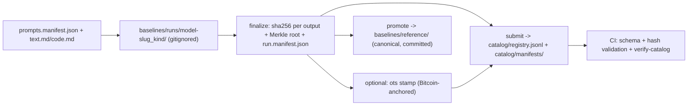

# Model baselines

Panoptes measures calibrated evidence of AI participation. To calibrate and evaluate that evidence honestly, the project needs **known-model reference data**: the same fixed prompts answered by many different models, recorded in a way anyone can verify and nobody has to take on trust alone.

This directory provides:

- a canonical prompt set (8 text + 8 code prompts), versioned and hashed;
- a tool (`baseline.py`) that produces per-model output folders, hashes every output, and writes a signed manifest;
- a community **catalog** where contributors share *hashes only*, so the world can reference and cross-check runs without the repo ever holding third-party raw outputs.



## The prompt set

- Human-friendly docs: [`prompts/text.md`](prompts/text.md) and [`prompts/code.md`](prompts/code.md) — open one and paste prompts into any model.
- Machine-readable source of truth: [`prompts/prompts.manifest.json`](prompts/prompts.manifest.json) (`panoptes-baseline-prompts-v1`).

All prompt text is original and PII-free. Every run is pinned to a prompt-set version and its SHA-256, so results from different people stay comparable. Follow the **run protocol** at the top of each prompt doc: fresh session, product defaults, single turn, no tools, raw unedited capture.

## Run a baseline

The folder convention is `<model-slug>_<kind>` — e.g. `gpt-5.6-sol_text`, `gpt-5.6-sol_code`. Slugs are lowercase (`gpt-5.6-sol`, `claude-opus-5`). Runs land in `baselines/runs/`, which is **gitignored**.

### Mode 1 — manual (any chat UI)

```bash
python baselines/baseline.py scaffold --model gpt-5.6-sol --kind text
# paste each prompt from baselines/prompts/text.md into the model,
# save each raw reply as the matching <prompt-id>.md in the new folder
python baselines/baseline.py finalize --run baselines/runs/gpt-5.6-sol_text \
  --interface chat-ui --reported-version "gpt-5.6-sol-2026-08-11"
```

### Mode 2 — scripted API run

```bash
set OPENAI_API_KEY=...        # Windows; export on macOS/Linux
python baselines/baseline.py run --model gpt-5.6-sol --provider openai --kind text
python baselines/baseline.py finalize --run baselines/runs/gpt-5.6-sol_text
```

Supports `openai` and `anthropic` providers (`--model-id` when the API id differs from the slug). Keys are read from the environment only and are never written to disk.

### Mode 3 — agent-assisted (Cursor)

1. Switch the Cursor chat model to the one you want to test.
2. Ask the agent to run the text (or code) baseline. It will scaffold `baselines/runs/_pending_text/` and write each prompt's raw output itself.
3. When it finishes, tell the agent **which model was active** — the agent never asserts its own identity.
4. The agent runs `finalize --model <slug> --interface agent-chat`, which hashes the outputs and renames the folder to `<slug>_text/`.

`agent-chat` runs are a distinctly labeled cohort: agent harnesses add system prompts and tools, so these outputs are never blended with clean `api`/`chat-ui` runs in analysis.

## Finalize, anchor, share

`finalize` writes `run.manifest.json` (`panoptes-baseline-run-v1`): model declaration, prompt-set hash, per-output SHA-256, a Merkle root over all outputs, and a canonical `artifact_sha256` of the manifest itself (same canonicalization as `research/validate_submission.py`).

**Optional blockchain anchor.** If you want a tamper-evident timestamp, install the OpenTimestamps client (`pip install opentimestamps-client`) and run `python baselines/baseline.py anchor --run <dir>`. The manifest hash is anchored to the Bitcoin blockchain; the `.ots` proof travels with the manifest. No custom chain, no cost, and the catalog works fine without it — git history is already an append-only ledger.

**Share with the community** (hashes only):

```bash
python baselines/baseline.py submit --run baselines/runs/gpt-5.6-sol_text --contributor your-handle
```

This validates the manifest, appends one line to `catalog/registry.jsonl`, and copies the manifest (and `.ots` proof) into `catalog/manifests/`. Open a PR with exactly those changes. Your raw outputs stay local and gitignored — the catalog never contains model text.

Maintainers promote the project's own canonical runs with `promote`, which copies full outputs into [`reference/`](reference/).

## Verify and trust

```bash
python baselines/baseline.py verify-catalog
```

re-validates every manifest against its schema, recomputes canonical hashes, and cross-checks the registry. CI runs this on every PR.

Be honest about what the ledger proves:

- A registry entry is a **claim** by a contributor, not verified provenance. The manifest's `reported_version` is what the contributor saw in the product; nobody can cryptographically prove which model answered.
- LLM outputs are non-deterministic: exact-hash replication is not expected. Confidence grows when independent contributors report statistically similar outputs for the same model and prompt-set version.
- An OpenTimestamps proof establishes *when* a manifest existed and that it hasn't changed — nothing more.
- Baselines exist to calibrate and audit Panoptes. They are not a model leaderboard and must not be used to rank, punish, or attribute authorship.

Consistent, independent runs can later graduate into a `datasets/manifests/` pointer and feed `research/` calibration — see `docs/contributing-markers.md` and `docs/evaluation.md`.
