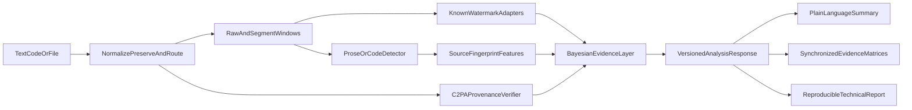

# Panoptes system design

Panoptes is an evidence workbench for analyzing prose, source code, and supported provenance files. It combines calibrated AI-participation probabilities, known statistical-watermark tests, source-family similarity, signed provenance verification, and segment-level visual explanations.

The system is intentionally conservative. It does not decide guilt, authorship, academic misconduct, or exact model identity. It reports evidence, uncertainty, coverage, and limitations.

## Scientific contract

Panoptes separates four evidence types. Statistical AI participation, source-family attribution, watermark tests, and cryptographic provenance are never blended into one score. Provenance is reported at levels P0–P4 (none, self-declared, authenticated metadata, signed receipt, independently verifiable execution).

| Evidence type | Question | What it can support | What it cannot support |
|---|---|---|---|
| Cryptographic provenance | Was a supported file signed with a C2PA manifest? | A specific issuer recorded processing or generation actions. | Authorship, originality, or text-level AI probability. |
| Known watermark evidence | Does text match a configured watermark scheme? | Evidence that cooperating generation likely used that scheme. | Detection of an unknown/private watermark. |
| Generic AI participation | Does content resemble calibrated machine-generated examples? | Probabilistic evidence of AI participation. | Proof of authorship or exact model identity. |
| Source-family similarity | Which supported generator families are stylistically closest? | Conditional similarity among trained candidates plus an unknown state. | Unsupported or exact model attribution. |

A negative result is not proof that content is human-written. Watermarks can be absent, removed, diluted, unsupported, or too short to test. Generic detectors can fail after paraphrase, translation, editing, or domain shift.

## Architecture

The initial deployment is deliberately boring: one Python FastAPI process serves the built TypeScript UI and analysis API. No database, queue, or persistent local state is required. Heavy models are lazy-loaded according to the selected runtime profile.

## Repository map

- `backend/` — FastAPI API, analysis pipeline, detectors, calibration, and CLI.
- `frontend/` — React/Vite user interface.
- `schemas/` — canonical JSON Schemas and golden response fixtures.
- `fixtures/` — deterministic sample inputs and expected responses.
- `bench/` — reproducible protocol, dataset fetchers, and evaluation pipelines.
- `sdk/python/` — typed Python client for the API.
- `plugins/` — examples and contracts for extensions.
- `docs/` — architecture, mathematics, interpretation, deployment, and contribution documentation.

## Privacy and safety policy

- Submitted text is analyzed in memory and is not stored by default.
- Raw text is excluded from application logs.
- Report exports are explicit user actions.
- Plugin loading is opt-in and local.
- No third-party analytics are included.
- Results must not be used as the sole basis for punitive, employment, academic-integrity, legal, or identity decisions.

## Runtime profiles

| Profile | Purpose | Models loaded | Typical use |
|---|---|---|---|
| `fixture` | Deterministic development and demos | None | CI, UI development, offline examples |
| `local-cpu` | First-class local analysis | Baseline prose/code models, lazy | Desktop Windows/macOS/Linux |
| `local-gpu` | Faster local inference | Enabled model set | Workstations with supported GPU |
| `cloud-cpu` | Small cloud deployment | Reduced baseline | Render/container hosting |
| `cloud-gpu` | Optional cloud scale | Enabled model set | GPU-backed container hosting |

Free cloud tiers are not assumed to be sufficient for full local inference. Fixture mode remains available for constrained environments.

## Intended use

Panoptes is appropriate for research, auditing, provenance triage, education, and developer tooling. It is not appropriate for automated punishment, identity attribution, or claims that a specific person did or did not write something.
